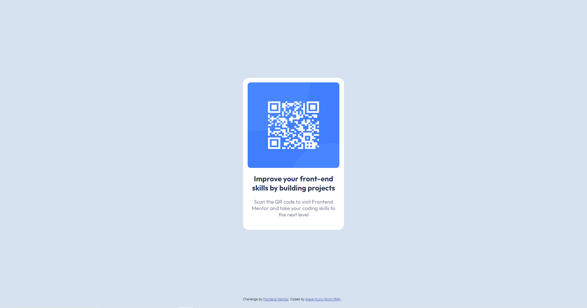

# Frontend Mentor - QR code component solution

This is my solution to the [QR code component challenge on Frontend Mentor](https://www.frontendmentor.io/challenges/qr-code-component-iux_sIO_H). It is my first Frontend Mentor challenge! Frontend Mentor challenges help you improve your coding skills by building realistic projects. 

Challenge Level: 1 -> Newbie 🟢

## Table of contents

- [Overview](#overview)
  - [Screenshot](#screenshot)
  - [Links](#links)
- [My process](#my-process)
  - [Built with](#built-with)
  - [What I learned](#what-i-learned)
- [Author](#author)

## Overview

### Screenshot

Here is a screenshot of my solution:

### Links

- Live Site URL: [See solution on my live site](https://frontend-mentor1-qr-code.vercel.app/)

## My process

### Built with

- HTML
- CSS
- [React](https://reactjs.org/) - JS library

### What I learned

This challenge was pretty straightforward and I had so much fun making it 💻! It was a great first challenge and helped me to review the basics of HTML and CSS. 
The only things I am not really sure about are:

- I had to use a font-size of 17px instead of 15px, as written in the styleguide, because the text would then be on two lines instead of three.
- I was not sure if there is a shadow around the box in the solution. It was hard to tell from the pictures, so I decided not to use a shadow.

I am happy for any feedback!

## Author

- Frontend Mentor - [@Orchi1904](https://www.frontendmentor.io/profile/orchi1904)
